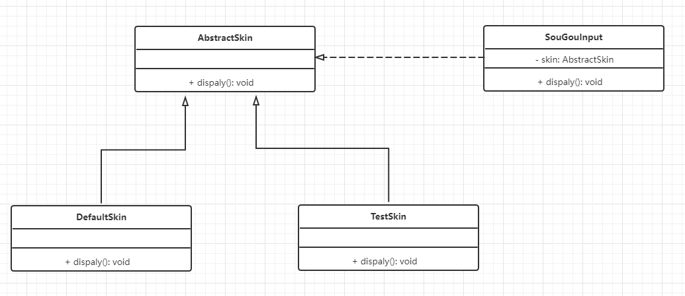

## 软件设计模式

### 一、分类

+ 创建型模式：用于描述“怎样创建对象”，特点：将对象的创建与使用分离，包含：单例、原型、工厂、抽象工厂、建造者等5种；
+ 结构型模式：用于描述“如何将类或对象按某种布局组合成更大的结构”，包含：代理、适配器、桥接、装饰、外观、享元、组合等7种；
+ 行为型模式：用于描述“类或对象之间如何共同协作完成单个对象无法单独完成的任务，以及怎样分配职责”，包含：模板方法、策略、命令、职责链、状态、观察者、中介者、迭代器、访问者、备忘录、解释器等11种。

### 二、软件设计原则

#### 1. 开闭原则

定义：对扩展开放，对修改关闭

