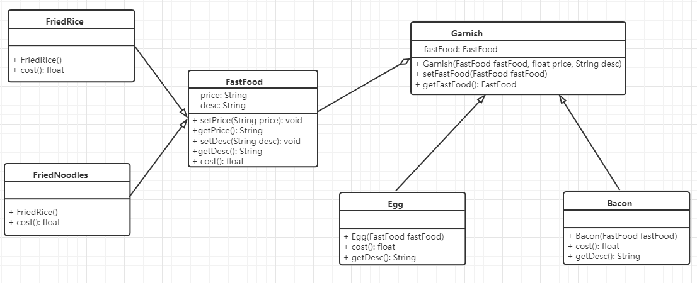

## 软件设计模式

*参考于it黑马*


### 一、分类

+ 创建型模式：用于描述“怎样创建对象”，特点：将对象的创建与使用分离，包含：单例、原型、工厂、抽象工厂、建造者等5种；
+ 结构型模式：用于描述“如何将类或对象按某种布局组合成更大的结构”，包含：代理、适配器、桥接、装饰、外观、享元、组合等7种；
+ 行为型模式：用于描述“类或对象之间如何共同协作完成单个对象无法单独完成的任务，以及怎样分配职责”，包含：模板方法、策略、命令、职责链、状态、观察者、中介者、迭代器、访问者、备忘录、解释器等11种。


### 二、软件设计原则

#### 1. 开闭原则

定义：对扩展开放，对修改关闭

以输入法更换皮肤为例：


#### 2. 里氏替换原则

定义：子类可以扩展父类的功能，但不能改变父类原有的功能（子类继承父类时，除了添加新的方法和功能外，尽量不要重写父类的方法）

以正方形不是长方形为例：

*在resize方法中，Rectangle类型的参数不能被Square类型的参数所代替，如果进行了替换，则不能得到预期的打印结果*


改进：

抽象出四边形接口，长方形、正方形实现四边形接口


#### 3. 依赖倒置原则

定义：高层模块不应该依赖低层模块，两者都应该依赖其抽象；抽象不应该依赖细节，细节应该依赖抽象

以组装电脑为例：

*存在的问题：现在的电脑只能使用给定的组件，如果要使用其他的，则违背了开闭原则*


改进：

抽象出各个配件的接口，让Computer类依赖抽象，而不是依赖于各组件的具体实现类


#### 4. 接口隔离原则

定义：客户端不应该被迫依赖于它不使用的方法，即：一个类对另一个类的依赖应该建立在最小的接口上

以安全门为例：

存在的问题：如果要增加新的品牌的安全门，则违背了开闭原则


改进：

抽象出安全门各个功能的接口，新增其他品牌的安全门时只需实现对应功能的接口


#### 5. 迪米特法则

定义：如果两个软件实体无需直接通信，那么就不应当发生直接的相互调用，可以通过第三方转发该调用，其目的是降低耦合，提高模块的相对独立性

以明星和经纪人为例：


#### 6. 合成复用原则

定义：尽量先使用组合或聚合等关联关系来实现，其次才考虑使用继承关系来实现

类的复用通常分为：继承复用、合成复用

+ 继承复用
  + 破坏了类的封装性，将父类的实现细节暴露给了子类，父类对子类是透明的，这种复用又称为**“白箱”**复用
  + 耦合度高，父类的实现的任何变化都会导致子类的实现发生变化，不利于类的维护和扩展
  + 灵活性低，从父类继承而来的实现是静态的，在编译时已定义，所以在运行时不可能发生变化
+ 合成复用（可将已有对象纳入新对象中，使之成为新对象的一部分，新对象可以调用已有对象的功能）
  + 维持了类的封装性，因为成员对象的内部细节是新对象看不见的，所以又称为**“黑箱”**复用
  + 耦合度低，可以在类的成员位置声明抽象
  + 灵活性高，这种复用可以在运行时动态进行，新对象可以动态的引用与成员对象类型相同的对象

以汽车分类管理为例：

汽车按**动力源**可分为汽油车、新能源车；按**颜色**可分为白色、红色；如果同时考虑这两种成分，会产生多种组合


可以看出使用继承复用会产生很多子类，如果要**添加新的**能源类型的车，就需要再定义**新**的类


### 三、创建者模式

特点：将对象的创建与使用分离，可以降低系统的耦合度，使用者不需要关注对象的创建细节

分为：单例模式、工厂模式、抽象工厂模式、原型模式、建造者模式


#### 1. 单例模式

单例模式涉及到一个单一的类，该类负责创建自己的对象，同时确保只有单个对象被创建，这个类提供了一种访问其唯一的对象的方式，可以直接访问，不需要实例化该类的对象

单例模式的实现：

+ 饿汉式：类一加载就创建该实例对象
+ 懒汉式：需要使用时才创建该实例对象


##### （1）饿汉式（静态变量方式）

该方式在成员位置声明 `Singleton` 类型的静态变量，并创建 `Singleton` 类的对象 `instance`，`instance` 对象随着类的加载被创建，如果该类足够大且一直没有被使用的情况下会造成内存的浪费


##### （2）饿汉式（静态代码块方式）

该方式在成员位置声明 `Singleton` 类型的静态变量，而对象的创建是在静态代码块中，也是随着类的加载而被创建，与**静态变量方式**类似


##### （3）懒汉式（线程不安全）

当调用 `getInstance()` 方法获取 `Singleton` 类的对象的时候才创建 `Singleton` 类的对象，这样就实现了**懒加载**，但在多线程操作时存在线程不安全的问题


##### （4）懒汉式（双重检测锁）

使用 `volatile` 关键字保证可见性和防止指令重排（JVM在实例化对象时会进行优化和指令重排序操作，可能产生空指针）


##### （5）懒汉式（静态内部类）

实例由内部类创建，由于JVM在加载外部类的过程中不会加载静态内部类，只有内部类的属性/方法被调用时才会被加载，并初始化其静态属性，其中静态属性由于被 `static` 修饰，保证只被实例化一次，并且严格保证实例化顺序

说明：第一次加载 `Singleton` 类时不会去初始化 `INSTANCE`，只有第一次调用 `getInstance()` 时，虚拟机加载 `SingletonHolder` 并初始化 `INSTANCE` ，这样既保证了现成安全，也保证了 `Singleton`  的唯一性，**在没有加任何锁的情况下保证了线程的安全且不造成性能和内存的浪费（双重检测锁方式 和 静态内部类方式可以任选其一）**


##### （6）枚举方式

枚举是线程安全的，且只会被加载一次，**注意枚举方式属于饿汉式**


##### （7）存在的问题

破坏单例模式的方式：

+ 序列化和反序列化
+ 反射

解决方法：

+ 序列化和反序列化 - 在单例类中添加 `readResolve()` 方法，在反序列化时，如果类中定义了这个方法，就返回这个方法的值，反之则创建新的对象
+ 反射 - 在单例类的构造方法中通过标志位来判断是否是第一次访问，且在该构造方法中需要加  `synchronized` 锁，锁该类 `synchronized(Singleton.class)`


#### 2. 工厂模式

##### （1）概述

以咖啡店点餐系统为例：


当需要添加不同类型的咖啡的时候，需要修改原有的代码，违背了开闭原则，此时如果使用工厂来生产不同类型的咖啡，则只需要与工厂产生对接，工厂模式的最大优点即**解耦**


##### （2）简单工厂模式

*简单工厂模式不属于GOF的23种经典设计模式，其更像是一种编程习惯*


> 结构

+ 抽象产品：定义产品的规范，描述产品的主要特性和功能

+ 具体产品：实现或继承抽象产品的子类
+ 具体工厂：提供创建产品的方法，调用者通过该方法来获取产品


> 实现


工厂处理创建对象的细节，一旦有了 `SimpleCoffeeFactory` 工厂类，`CoffeeStore` 类中的 `orderCoffee()` 就变成此对象的客户，后期如果需要 `Coffee` 对象直接从工厂获取即可，解除了和 `Cooffee` 实现类的耦合，但同时又产生了新的耦合：`CoffeeStore` 对象与 `SimpleCoffeeFactory` 工厂对象，`SimpleCoffeeFactory` 工厂对象 与 生产的商品对象


> 优缺点

+ 封装了创建对象的过程，可以通过参数直接获取对象，把对象的创建与业务逻辑分开，避免了修改客户端代码，如果要添加新的产品则直接修改工厂类
+ 增加新产品时需要修改原有的工厂类，违背了**开闭原则**


> 扩展（静态工厂）

```java
public class SimpleCoffeeFactory {

    public static Coffee createCoffee(String type) {
        //声明coffee类型的变量，根据不同类型创建不同的coffee子类
        Coffee coffee = null;
        if ("american".equals(type)) {
            coffee = new AmericanCoffee();
        } else if ("latte".equals(type)) {
            coffee = new LatteCoffee();
        } else {
            throw new RuntimeException("该类型的咖啡暂未上架");
        }
        return coffee;
    }
}
```


##### （2）工厂方法模式

> 概念

定义一个用于创建对象的接口，让子类决定实例化哪个产品类对象，工厂方法使一个产品类的实例化延迟到其工厂的子类


> 结构

+ 抽象工厂：提供创建产品的接口，调用者通过它访问具体工厂的方法来创建产品
+ 具体工厂：实现抽象工厂中的抽象方法，完成具体产品的创建
+ 抽象产品：定义产品的规范，描述产品的主要功能和特性
+ 具体产品：实现抽象产品定义的接口，由具体工厂来创建（与具体工厂一一对应）


> 实现


工厂方法模式是简单工厂模式的进一步抽象，由于使用了多态，既保持了简单工厂模式的优点，同时也解决了它的缺点


> 优缺点

+ 用户只需要知道具体工厂的名称就能得到需要的产品，无需关心产品的具体创建过程
+ 增加新的产品时只需添加具体产品类和对应的工厂类，无须对原工厂进行修改，满足**开闭原则**
+ 每增加一个产品就要增加一个具体产品类和对应的工厂类，增加了系统的复杂度


##### （3）抽象工厂模式

> 概念

为访问类提供一个创建一组或相互依赖对象的接口，且访问类无须指定所要产品的具体类就能得到同族的不同等级的产品的模式结构


> 结构

+ 抽象工厂：提供创建产品的接口，它包含多个创建产品的方法，可以创建多个不同等级的产品
+ 具体工厂：主要是实现抽象工厂中的多个抽象方法，完成具体产品的创建
+ 抽象产品：定义产品的规范，描述产品的主要功能和特性（抽象工厂模式具有多个抽象产品）

+ 具体产品：实现抽象产品角色所定义的接口，由具体工厂来创建，它与具体工厂之间是**多对一**的关系


> 实现

当咖啡店业务发生变化时，不仅要上架咖啡，还需要上架甜点（提拉米苏、抹茶慕斯），按照工厂方法模式，很容易发生类爆炸的问题；其中：

+ 拿铁、美式属于一个产品等级，都是咖啡；

+ 提拉米苏、抹茶慕斯属于一个产品等级，都是甜点；

+ 拿铁、提拉米苏属于一个产品类别，都是意大利风味；

+ 美式、抹茶慕斯属于一个产品类别，都是美式风味

可以使用抽象工厂模式来实现：


如果要添加同一个产品族的话，只需添加一个对应的甜品工厂类，满足开闭原则


> 优缺点

+ 当一个产品族中的多个对象被设计成一起工作时，它能保证客户端始终只使用同一个产品族中的对象
+ 当产品族中需要增加一个新的产品时，所有的工厂类都需要需改


> 使用场景

+ 当需要创建的对象是一系列相互关联或相互依赖的产品族时，如生产厂商的电视机、洗衣机、空调等
+ 系统中有多个产品族，但每次只使用其中的一个产品族，如某人只喜欢某一品牌的服装
+ 系统中提供了产品的类库，且所有产品的接口相同，客户端不依赖产品实例的创建细节和内部结构，如输入法更换皮肤


##### （4）模式扩展

**简单工厂 + 配置文件解耦**

在工厂类中加载配置文件的全类名，并创建对象进行存储，客户端如果需要对象，直接获取即可

a. 定义配置文件

`bean.properties`

```properties
american=com.sw.设计模式.创建者模式.factory.configFactory.AmericanCoffee
latte=com.sw.设计模式.创建者模式.factory.configFactory.LatteCoffee
```

b. 改进工厂类

```java
public class CoffeeFactory {

    //加载配置文件，获取配置文件中配置的全类名，并创建该类的对象进行存储
    //1.定义容器对象存储咖啡
    private static HashMap<String, Coffee> map = new HashMap<>();

    //2.加载配置文件
    static {
        //创建properties对象
        Properties p = new Properties();
        //调用load()方法进行加载
        InputStream is = CoffeeFactory.class.getClassLoader().getResourceAsStream("bean.properties");
        try {
            p.load(is);
            //从p集合中获取全类名并创建对象
            for (Object key : p.keySet()) {
                String className = p.getProperty((String) key);
                Class<?> clazz = Class.forName(className);
                Coffee coffee = (Coffee) clazz.newInstance();
                //存储
                map.put((String) key, coffee);
            }
        } catch (IOException | ClassNotFoundException | InstantiationException | IllegalAccessException e) {
            throw new RuntimeException(e);
        }

    }

    /**
     * 根据名称获取对象
     *
     * @param name 名称
     * @return
     */
    public static Coffee createCoffee(String name) {
        return map.get(name);
    }
}
```

使用静态成员变量来存储创建的对象，在静态代码块中读取配置文件并创建对象

```java
public class Client {
    public static void main(String[] args) {
        Coffee coffee = CoffeeFactory.createCoffee("american");
        //美式咖啡
        System.out.println(coffee.getName());

        System.out.println("=============================");

        Coffee coffee1 = CoffeeFactory.createCoffee("latte");
        //拿铁咖啡
        System.out.println(coffee1.getName());
    }
}
```


#### 3. 原型模式

##### （1）概述

用一个已经创建的实例作为原型，通过复制该原型对象来创建一个和原型对象相同的新对象


##### （2）结构

+ 抽象原型类：规定了具体原型对象必须实现的 `clone()` 方法

+ 具体原型类：实现抽象原型类的 `clone()` 方法，它是可被复制的对象

+ 访问类：使用具体原型类中的 `clone()` 方法来复制新的对象

接口类图：


##### （3）实现

原型模式的克隆分为**浅克隆**和**深克隆**：

+ 浅克隆：创建一个新对象，新对象的属性和原来对象完全相同，对于非基本类型，仍指向原有属性所指向的对象的内存地址
+ 深克隆：创建一个新对象，属性中引用的其他对象也会被克隆，且不再指向原有对象地址

Java中 `Object` 类提供了 `clone()` 方法来实现浅克隆，`Cloneable` 接口是上面类图中的抽象原型类，而实现了 `Cloneable` 接口的子实现类就是具体的原型类。

**原型类**

```java
public class Realizetype implements Cloneable {

    public Realizetype() {
        System.out.println("具体原型对象创建完成");
    }

    @Override
    public Realizetype clone() throws CloneNotSupportedException {
        System.out.println("具体原型复制成功");
        return (Realizetype) super.clone();
    }
}
```

**测试**

```java
public class Client {
    public static void main(String[] args) throws CloneNotSupportedException {
        //创建原型对象
        Realizetype realizetype = new Realizetype();
        //调用clone方法进行对象的克隆
        Realizetype realizetype1 = realizetype.clone();

        //具体原型对象创建完成
        //具体原型复制成功
        //false
        System.out.println(realizetype == realizetype1);
    }
}
```


##### （4）案例

以学校发放“三好学生”奖状为例


##### （5）使用场景

+ 对象的创建非常复杂
+ 性能和安全要求较高


##### （6）深克隆

将奖状案例中的 `name` 属性修改为 `Student` 复杂对象属性

```java
public class CitationTest {
    public static void main(String[] args) throws CloneNotSupportedException {
        //创建原型对象
        Citation citation = new Citation();

        //创建学生
        Student student = new Student();
        student.setName("孙笑川");
        citation.setStudent(student);

        //复制奖状
        Citation citation1 = citation.clone();
        citation1.getStudent().setName("药水哥");

        //展示奖状
        citation.show();
        citation1.show();

        //药水哥同学，在本学年表现优秀，被评为“三好学生”，特发此状，以资鼓励！
        //药水哥同学，在本学年表现优秀，被评为“三好学生”，特发此状，以资鼓励！
    }
}
```

存在的问题：使用浅克隆时，克隆出来的对象属性中的 `student1` 和第一次创建的 `student` 是同一个对象，此时 `setName` 方法设置的值是同一个

改进：（使用对象流）

```java
public class CitationTest {
    public static void main(String[] args) throws Exception {
        //创建原型对象
        Citation citation = new Citation();

        //创建学生
        Student student = new Student();
        student.setName("孙笑川");
        citation.setStudent(student);

        //创建对象输出流
        ObjectOutputStream oos = new ObjectOutputStream(Files.newOutputStream(Paths.get("D:/citation.txt")));
        //写对象
        oos.writeObject(citation);
        //释放资源
        oos.close();

        //创建对象
        ObjectInputStream ois = new ObjectInputStream(Files.newInputStream(Paths.get("D:/citation.txt")));
        Citation citation1 = (Citation) ois.readObject();
        ois.close();

        citation1.getStudent().setName("药水哥");

        citation.show();
        citation1.show();
    }
}
```


#### 4. 建造者模式

##### （1）概述

将一个复杂对象的构建与表示分离，使得同样的构建过程可以创建不同的表示


##### （2）结构

+ 抽象建造者类（Builder）：该接口规定要实现复杂对象的哪些部分的创建，并不涉及具体部件的创建
+ 具体建造者类（ConcreteBuilder）：实现 `Builder` 接口，完成复杂对象的各个部件的具体创建方法，在构造过程完成后，提供产品的实例
+ 产品类（Product）：要创建的复杂对象
+ 指导者类（Director）：调用具体建造者来创建复杂对象的各个部分，在指导者中不涉及具体产品的信息，只负责保证对象各部分完整创建或按某种顺序创建


##### （3）实例

以生产单车为例


以上实例可以将**指导者**和**抽象建造者**结合，这样做可以简化系统复杂度，但**不符合单一职责原则**

```java
public abstract class Builder {

    protected Bike bike = new Bike();

    /**
     * 生产车架
     */
    public abstract void buildFrame();

    /**
     * 生产车座
     */
    public abstract void buildSeat();

    /**
     * 生产自行车
     *
     * @return
     */
    public abstract Bike createBike();
    
    public Bike construct() {
        this.buildFrame();
        this.buildSeat();
        return this.createBike();
    }
}
```


##### （5）优缺点

+ 封装性好，建造者模式可以有效的封装变化，在该过程中，产品类与建造者类相对稳定，将复杂的业务逻辑封装在指导者类中对整体而言有较好的稳定性
+ 在建造者模式中，客户端无需关心产品内部组成的细节，将产品本身与创建的过程解耦，使得相同的创建过程可以建造不同的产品
+ 可以更细粒度的控制产品的创建过程，即将复杂对象的创建步骤分解在不同的方法中，可以使创建过程更加清晰，也可以更好的控制创建过程
+ 易扩展，当有同类产品的新的需求时，新增一个建造者就可以完成，符合开闭原则
+ 建造者模式所创建的产品一般来说有较多的相同点，其组成部分相似，如果产品之间差异较大，则不适合使用建造者模式，使其适用范围受限


##### （6）使用场景

+ 创建的对象较复杂，有多个部件构成，各部件面临着复杂的变化，但构件间的建造顺序是稳定的
+ 创建复杂对象的算法独立于该对象的组成部分以及它们的装配方式，即产品的构建过程和最终的表示是独立的


##### （7）扩展

当一个类的构造器需要传入很多参数时，如果创建该类的实例，可能导致代码可读性差和引入新的错误，此时可以使用建造者模式进行重构

```java
public class Phone {

    private String cpu;
    private String screen;
    private String memory;
    private String mainBoard;

    //私有构造器
    private Phone(Builder builder) {
        this.cpu = builder.cpu;
        this.screen = builder.screen;
        this.memory = builder.memory;
        this.mainBoard = builder.mainBoard;
    }

    public static final class Builder {
        private String cpu;
        private String screen;
        private String memory;
        private String mainBoard;

        public Builder cpu(String cpu) {
            this.cpu = cpu;
            return this;
        }

        public Builder screen(String screen) {
            this.screen = screen;
            return this;
        }

        public Builder memory(String memory) {
            this.memory = memory;
            return this;
        }

        public Builder mainBoard(String mainBoard) {
            this.mainBoard = mainBoard;
            return this;
        }

        //使用建造者创建Phone对象
        public Phone build() {
            return new Phone(this);
        }
    }

    @Override
    public String toString() {
        return "Phone{" +
                "cpu='" + cpu + '\'' +
                ", screen='" + screen + '\'' +
                ", memory='" + memory + '\'' +
                ", mainBoard='" + mainBoard + '\'' +
                '}';
    }
}
```


### 四、结构型模式

描述如何将类或对象按某种布局组合成更大的结构，分为类结构型模式和对象结构型模式，前者采用继承来组织接口和类，后者采用组合或聚合来组合对象

分为：代理模式、适配器模式、装饰者模式、桥接模式、外观模式、组合模式、享元模式

#### 1. 代理模式

##### （1）概述

由于某些原因需要给某对象提供一个代理以控制对该对象的访问，这时，访问对象不适合或不能直接引用目标对象，代理对象作为访问对象与目标对象之间的中介

Java中的代理按照类生成时机的不同分为**静态代理**和**动态代理**，静态代理 代理类在编译时生成，动态代理 代理类在运行时动态生成（JDK动态代理、CGLib动态代理）


##### （2）结构

+ 抽象主题类：通过接口或抽象类声明真实主题和代理对象实现的业务方法
+ 真实主题类：实现抽象主题中的具体业务，是代理对象所代表的真实对象，是最终要引用的对象
+ 代理类：提供与真实主题相同的接口，其内部含有对真实主题的引用，它可以访问、控制以及扩展真实主题的功能


##### （3）静态代理

以火车站卖票为例


##### （4）JDk动态代理

Java中提供了一个动态代理类 `Proxy` ，即提供了一个创建代理对象的静态方法 `newProxyInstance` 来获取代理对象

使用`Arthas` （阿尔萨斯）查看代理类的结构：

```java
package com.sun.proxy;

import com.itheima.proxy.dynamic.jdk.SellTickets;
import java.lang.reflect.InvocationHandler;
import java.lang.reflect.Method;
import java.lang.reflect.Proxy;
import java.lang.reflect.UndeclaredThrowableException;

public final class $Proxy0 extends Proxy implements SellTickets {
    private static Method m1;
    private static Method m2;
    private static Method m3;
    private static Method m0;

    public $Proxy0(InvocationHandler invocationHandler) {
        super(invocationHandler);
    }

    static {
        try {
            m1 = Class.forName("java.lang.Object").getMethod("equals", Class.forName("java.lang.Object"));
            m2 = Class.forName("java.lang.Object").getMethod("toString", new Class[0]);
            m3 = Class.forName("com.itheima.proxy.dynamic.jdk.SellTickets").getMethod("sell", new Class[0]);
            m0 = Class.forName("java.lang.Object").getMethod("hashCode", new Class[0]);
            return;
        }
        catch (NoSuchMethodException noSuchMethodException) {
            throw new NoSuchMethodError(noSuchMethodException.getMessage());
        }
        catch (ClassNotFoundException classNotFoundException) {
            throw new NoClassDefFoundError(classNotFoundException.getMessage());
        }
    }

    public final boolean equals(Object object) {
        try {
            return (Boolean)this.h.invoke(this, m1, new Object[]{object});
        }
        catch (Error | RuntimeException throwable) {
            throw throwable;
        }
        catch (Throwable throwable) {
            throw new UndeclaredThrowableException(throwable);
        }
    }

    public final String toString() {
        try {
            return (String)this.h.invoke(this, m2, null);
        }
        catch (Error | RuntimeException throwable) {
            throw throwable;
        }
        catch (Throwable throwable) {
            throw new UndeclaredThrowableException(throwable);
        }
    }

    public final int hashCode() {
        try {
            return (Integer)this.h.invoke(this, m0, null);
        }
        catch (Error | RuntimeException throwable) {
            throw throwable;
        }
        catch (Throwable throwable) {
            throw new UndeclaredThrowableException(throwable);
        }
    }

    public final void sell() {
        try {
            this.h.invoke(this, m3, null);
            return;
        }
        catch (Error | RuntimeException throwable) {
            throw throwable;
        }
        catch (Throwable throwable) {
            throw new UndeclaredThrowableException(throwable);
        }
    }
}
```

从以上类结构可以看出：

+ 代理类 `$Proxy0` 实现了 `SellTickets`，即真实类和代理类都实现了同样的接口
+ 代理类 `$Proxy0` 将我们提供了的匿名内部类 `invocationHandler` 传递给了父类
+ 动态代理执行流程：
  + 在测试类（访问类）中通过代理对象调用 `sell()` 方法
  + 根据多态的特性，执行的代理类是 `$Proxy0` 中的 `sell()` 方法
  + 代理类 `$Proxy0` 中的 `sell()` 方法中又调用了 `invocationHandler` 接口的子实现类对象的 `invoke()` 方法
  + `invoke` 方法通过反射执行了真实对象所属类 `TrainStation` 中的 `sell()` 方法


##### （5）CGLib动态代理

如果没有定义 `SellTickets` 接口，只定义了 `TrainStation` 火车站类，此时无法使用JDK动态代理，因为它要求必须定义接口


##### （6）三种代理模式的对比

+ 静态代理与动态代理：
  + 动态代理将接口中声明的所有方法都转移到调用处理器一个集中的方法中处理（JDK：InvocationHandler.invoke()），在接口方法较多的情况下可以进行灵活的处理；反之静态代理每增加一个方法就需要新增对应的代理类
+ JDK与CGLib动态代理：
  + `CGLib` 底层采用 `ASM` 字节码生成框架，使用字节码技术生成代理类，在 `JDK1.6` 之前比使用 Java反射效率要高，其中需注意：`CGLib` 不能对声明为 `final` 类型的类或方法进行代理，因为 `CGLib` 原理是动态生成被代理类的子类
  + 在`JDK1.6、1.7、1.8`逐步优化之后，在调用次数较少的情况下，其效率高于 `CGLib` 动态代理，在大量调用的情况下，`CGLib` 效率优于 `JDK1.6、1.7`，`JDK1.8` 时效率高于 `CGLib`
  + **有接口时**使用JDK动态代理，**没有接口时**使用CGLib动态代理


##### （7）优缺点

+ 代理模式在客户端与目标对象之间起到中介的作用和保护目标对象的作用
+ 可以扩展目标对象的功能
+ 将客户端与目标对象分离，降低了耦合度
+ 增加了系统的复杂度


##### （8）使用场景

+ 远程代理（Remote）

  本地服务通过网络请求远程服务，将通信部份隐藏起来，只暴露给本地服务一个接口，通过该接口访问远程服务所提供的功能，而不必过多关心通信细节的部分，如：`RPC` 远程调用

+ 防火墙代理

  在浏览器配置代理功能时，防火墙将请求转发给互联网，收到响应之后再转发给浏览器

+ 保护代理

  控制一个对象的访问，可以给不同的用户提供不同的使用权限


#### 2. 适配器模式

##### （1）概述

将一个类的接口转换成客户希望的另一个接口，使得原本由于接口不兼容而不能一起工作的类能一起工作，分为**类适配器模式**（耦合度高）和**对象适配器模式**


##### （2）结构

+ 目标接口：当前系统业务所期待的接口（抽象类或接口）
+ 适配者类：它是被访问和适配的现存组件库中的组件接口
+ 适配器类：它是一个转换器，通过继承或引用适配者的对象，把适配者接口转换成目标接口，让客户按目标接口的格式访问适配者


##### （3）类适配器模式

实现方式：定义一个适配器类来实现当前系统的业务接口（即目标接口），同时又继承现有组件库中已经存在的组件（即适配者类）

以读卡器为例：


类适配器模式违背了合成复用原则，在客户类有一个明确的接口规范的情况下可用，反之不可用


##### （4）对象适配器模式

实现方式：采用将现有组件库中已实现的组件引入适配器类中，该类同时实现当前系统的业务接口

读卡器案例改进：


对象适配器模式解决了类适配器模式中存在的问题；同时还有**接口适配器模式**，当不希望实现一个接口中的所有方法时，可以定义一个 `Adapter` 抽象类，实现目标接口中的所有方法，适配器类再继承该抽象类，根据需要选择所需的方法


##### （5）应用场景

+ 原系统存在满足新系统功能需求的类，但存在接口不一致的问题时
+ 使用第三方提供的组件，但所需组件接口与自己接口定义不同的时候


#### 3. 装饰者模式

##### （1）概述

在不改变现有对象结构的情况下，动态的给该对象增加额外的职责或功能


##### （2）结构

+ 抽象构建角色：定义一个抽象接口以规范准备接收附加责任的对象
+ 具体构建角色：实现抽象构建，通过装饰角色为其添加一些职责
+ 抽象装饰角色：继承或实现抽象构建，并包含具体构建的实例，可以通过其子类扩展具体构建的功能
+ 具体装饰角色：实现抽象装饰的相关方法，并给具体构建对象添加附加的职责或功能


##### （3）案例

以快餐店为例：




##### （4）优缺点

+ 装饰者模式可以带来比继承更加灵活的扩展功能，可以通过组合不同的装饰者对象来获取具有不同行为状态的多样化的结果
+ 遵循开闭原则，继承是静态的附加责任，装饰者则是动态的附加责任
+ 装饰类和被装饰类可以各自独立发展，不会产生耦合，装饰者模式是继承的一个替代模式，可以动态扩展一个实现类的功能


##### （5）使用场景

+ 当不能采用继承的方式对系统进行扩充或采用继承不利于系统扩展和维护时
  + 类中存在大量独立的扩展，使用继承可能会造成类爆炸时
  + 被 `final` 修饰的类
+ 在不影响其他对象的情况下，以动态、透明的方式给单个对象添加功能或职责
+ 当对象的功能要求动态添加，动态移除时


##### （6）静态代理与装饰者模式的区别

+ 相同点：

  + 都要实现与目标类相同的业务接口
  + 在两个类中都要声明目标对象
  + 都可以在不修改目标对象的前提下进行功能增强

+ 不同点：

  + 目的不同：

    装饰者增强目标对象

    静态代理保护和隐藏目标对象

  + 获取目标对象构建的地方不同

    装饰者中的目标对象由外界传递（通过构造方法或set赋值）

    静态代理的目标对象在代理类内部创建，以此来完成隐藏和保护


#### 4. 桥接模式

##### （1）概述

将抽象与实现分离，使它们可以独立变化，用组合关系代替继承关系来实现，从而降低抽象和实现这两个可变维度的耦合度


##### （2）结构

+ 抽象化角色：定义抽象类，并包含一个对实现化角色的引用
+ 扩展抽象化角色：是抽象化角色的子类，实现父类中的业务方法，并通过组合关系调用实现化角色中的业务方法
+ 实现化角色：定义实现化角色的接口（也可以是抽象类），供扩展抽象化角色调用
+ 具体实现化角色：给出实现化角色接口的具体实现


##### （3）案例

以视频播放器为例（可以在不同操作系统上播放多种格式的视频文件）


##### （4）优缺点

+ 提高了系统的可扩展性，在两个变化的维度中任意扩展一个维度，都不需要修改原有系统
+ 实现细节对客户透明


##### （5）使用场景

+ 当一个类存在两个独立变化的维度，且这两个维度都需要扩展时
+ 当一个系统不希望使用继承或因多层次继承导致类爆炸时
+ 当一个系统需要在构建的抽象化角色和具体化角色之间增加更多的灵活性时（避免在两个层次之间建立静态的继承联系，可通过桥接模式（聚合引用方式）使它们在抽象层建立一个关联关系）


#### 5. 外观模式

##### （1）概述

外观模式又称门面模式，是一种通过为多个复杂的子系统提供一个一致的接口，而使这些子系统更容易被访问，外部应用程序无需关心内部子系统的具体细节，它是“迪米特法则”的典型应用


##### （2）结构

+ 外观角色：为多个子系统对外提供一个共同的接口
+ 子系统角色：实现系统的部分功能，客户可以通过外观角色访问它


##### （3）案例

以智能音箱控制家电为例


##### （4）优缺点

+ 降低了子系统与客户端之间的耦合度
+ 对客户屏蔽了子系统组件
+ 不符合开闭原则


##### （5）使用场景

+ 对分层系统构建时，使用外观模式定义每层的入口点可以简化子系统之间的依赖关系
+ 当一个复杂系统的子系统很多时，外观模式可以提供简单的接口供外界访问
+ 当客户端与多个子系统之间存在很大的联系时，引入外观模式可将他们分离从而提高子系统的独立性和可移植性


#### 6. 组合模式

##### （1）概述

组合模式又称为部分整体模式，是用于把一组相似的对象当作一个单一的对象，该模式依据树形结构来组合对象，用来表示部分以及整体层次


##### （2）结构

+ 抽象根节点：定义系统各层次对象的共有方法和属性，可以预先定义一些默认行为和属性
+ 树枝节点：定义树枝节点的行为，存储子节点，组合树枝节点和叶子节点形成树结构
+ 叶子节点：其下再无分支，是系统层次遍历的最小单位


##### （3）案例

以树形菜单为例：


##### （4）分类

+ 透明组合模式

  + 在该模式中，抽象根节点角色声明了所有用于管理成员对象的方法，以此确保所有的构建类都有相同的接口，即标准组合模式
  + 该模式不够安全，因为**叶子对象**和**容器对象**有着本质上的区别，叶子对象不可能有下级节点（即不包含成员对象）因此提供的 `add()`、`remove()`方法是没有意义的，在运行时调用由于未提供相应的错误处理代码而出错

+ 安全组合模式

  + 该模式中的抽象根节点角色未提供任何管理成员对象的方法，而是在**树枝节点**类中声明并实现这些方法，它的缺点是不够透明，因为叶子对象和容器对象具有不同的方法，容器对象中用于管理成员对象的方法没有在抽象根节点中定义，客户端不能实现相应的抽象编程，必须**区别对待**叶子对象和容器对象

    


##### （5）优缺点

+ 可以清楚定义分层次的复杂对象，表示对象的全部或部分层次，让客户端忽略了层次的差异，便于对整个层次结构的管理
+ 客户端可以一致的使用一个组合结构或其中的单个对象，无需关心处理的是单个对象还是整个组合结构
+ 新增/删除节点符合开闭原则
+ 通过叶子节点和树枝节点的递归组合，可以形成复杂的树形结构，但整个管理的过程并不复杂


##### （6）使用场景

多用于需要使用树形结构的场景


#### 7. 享元模式

##### （1）概述

运用共享技术来有效支持大量细粒度对象的复用，通过共享已经存在的对象来大幅度减少需要创建对象的数量、避免大量相似对象的开销，从而提高系统资源的利用率


##### （2）结构

享元模式存在两种状态：

+ 内部状态，即不会随着环境的改变而改变的可共享部分
+ 外部状态，内部状态反之

享元模式实现的要领就是区分应用中的这两种状态，并将外部状态外部化


包含的角色：

+ 抽象享元角色：通常是一个接口或抽象类，声明具体享元类公共的方法，这些方法可以向外界提供享元对象的内部数据（内部状态），同时也可以通过这些方法来设置外部数据（外部状态）
+ 具体享元角色：它实现了抽象享元类，称为享元对象；在具体享元类中为内部状态提供了存储空间（可以结合单例模式来设计具体享元类）
+ 非享元角色：并不是所有抽象享元类的子类都需要被共享不能被共享的子类可以设计为非共享具体享元类，当需要它时，可以直接通过实例化创建
+ 享元工厂角色：负责创建和管理享元角色，当客户对象请求一个享元对象时，享元工厂检查系统中是否存在该对象，有则直接提供，反之则创建一个对应的新的享元对象


##### （3）案例

以俄罗斯方块为例：


##### （4）优缺点

+ 极大地减少了内存中相同或相似对象的数量，节约了资源
+ 享元模式中的外部状态相对独立，且不影响内部状态
+ 为了使对象可以共享，需要装享元对象的部分状态外部化，增加了系统的复杂度


##### （5）使用场景

+ 系统中有大量相同或相似的对象
+ 对象的大部分状态都可以外部化，可以将这些外部状态传入对象中
+ 在使用该模式时需要维护对应的享元对象存储池，需要耗费一定的资源，因此，须在多次重复使用享元对象且必要的情况下才使用该模式


### 五、行为型模式

用于描述程序在运行时复杂的流程控制，即描述多个类或对象之间怎样相互协作共同完成单个对象无法单独完成的任务，涉及算法和对象间职责的分配

分为：模板方法、策略模式、命令模式、责任链模式、状态模式、观察者模式、中介者模式、迭代器模式、访问者模式、备忘录模式、解释器模式；其中模板方法、解释器模式属于**类行为模式**，其他属于**对象行为模式**


#### 1. 模板方法

##### （1）概述

定义一个操作中的算法骨架，并将其中的一些步骤延迟到子类中执行，使得子类可以在不改变主干步骤的情况下重定义该算法的某些特定步骤


##### （2）结构

+ 抽象类：负责给出一个算法的轮廓和骨架，由一个模板方法和若干个基本方法构成
  + 模板方法：定义算法的骨架，按指定的顺序调用其包含的基本方法
  + 基本方法：实现算法的各个步骤（模板方法的组成部分）
    + 抽象方法：由抽象类声明，由其具体子类实现
    + 具体方法：由抽象类或具体类声明并实现，其子类可以进行覆盖也可以直接继承
    + 钩子方法：在抽象类中已实现，包括用于判断的逻辑方法和需要子类重写的空方法两个部分
+ 具体子类：实现抽象类中定义的抽象方法和钩子方法

*钩子方法一般是用于做判断的逻辑方法，类名为 `isXXX`，返回值类型为 `boolean`*


##### （3）案例

以炒菜为例


##### （4）优缺点

+ 代码复用，相同的代码可以放到抽象父类中，不同的代码放在对应的子类中
+ 实现了反向控制，通过父类调用其子类的操作，并通过子类的不同实现扩展不同的行为，复合**开闭原则**
+ 对每个不同的实现都需要定义一个子类，导致类的个数及系统设计难度的增加
+ 反向控制降低了代码的易读性


##### （5）使用场景

+ 算法的整体步骤固定，但其中的个别部分易变时，使用模板方法可将易变的部分抽象出来，由其子类实现
+ 需要通过子类决定父类中的某个步骤是否执行，实现子类对父类的反向控制


#### 2. 策略模式

##### （1）概述

该模式定义了一系列算法，并将每个算法封装起来，使它们可以相互替换，且算法的变换不会影响客户的使用；它属于对象行为模式，通过对算法进行封装，把使用算法的责任和算法的实现分开，并委派给不同的对象对这些算法进行管理


##### （2）结构

+ 抽象策略类：该角色给出所有的策略类所需的接口
+ 具体策略类：实现抽象策略定义的接口，提供具体的算法实现或行为
+ 环境类：持有一个策略类的引用，供客户端调用


##### （3）案例

以促销活动为例


##### （4）优缺点

+ 策略类之间可以自由切换
+ 新增策略时增加对应的具体策略类即可，复合开闭原则
+ 在一定程度上减少了条件选择语句的使用
+ 客户端必须知道所有的策略类，并自行决定使用哪一个
+ 可能产生很多的具体策略类


##### （5）使用场景

+ 系统中需要动态的在几种算法中选择一种时
+ 一个类定义了多种行为，且这些行为在这个类的操作中以多个条件语句的形式出现时，可将每个分支条件移入各自对应的策略类中
+ 系统中的算法各自独立，且要求对客户隐藏实现的细节时
+ 多个类只区别在表现型为不同，可选择策略模式，在运行时动态选择具体要执行的行为